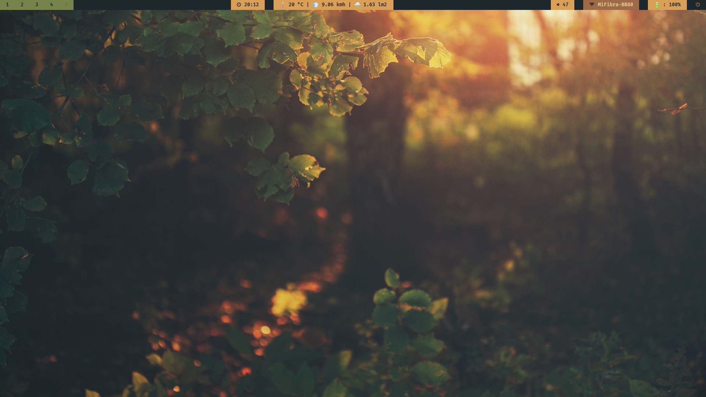

# CFOL Polybar Theme 🖥️

This repository contains a customized **Polybar** theme based on the `001` theme from the `stav121/i3wm-themer` project. It provides a clean and functional setup for i3, with several key additions to enhance the user experience.

---

### Features

* **PulseAudio Integration:** The theme has been modified to support the **PulseAudio** sound server, ensuring your volume controls work out of the box.
* **Battery Status Module:** A custom module was created to accurately display the battery status by reading data from the `/sys/class/power_supply/BAT0/capacity` file.
* **MeteoGalicia Weather Service:** The most significant addition is a custom-built weather service that provides up-to-date weather information specifically for the A Coruña region.

    

---

### Weather Service Technical Details

The custom weather module is a Python application designed to efficiently retrieve and manage weather data from the [**MeteoGalicia API**](https://www.meteogalicia.gal/web/modelos-numericos/meteosix). To ensure it's both accurate and performant, the service was built with the following components:

* **Data Orchestration:** The core logic resides in `app.py`, which acts as the brain of the service. It checks two factors to determine if a weather update is needed: whether your location has changed or if the cached weather data has expired.
* **Intelligent Caching:** The `location_cache.py` class prevents redundant API calls by storing your current location and setting an expiration date on the cached weather data. This saves bandwidth and reduces load on the API.
* **Database Management:** The service uses **SQLite3** as a lightweight relational database to store the retrieved weather data. The database access object (DAO) is defined in `wdb_DAO.py`, which uses a configurable JSON file to manage the SQL queries, making the data layer flexible and easy to modify.
* **Service Layer:** The `services` directory contains classes for getting your geolocation using your IP and for sending requests to the MeteoGalicia API, cleanly separating the data-fetching logic.

---

## Installation/Set-up

>[!NOTE]
In progress...

---

### Credits

This project is a customization of the excellent work by `stav121`. The original theme can be found at:

* **Original Project:** `https://github.com/stav121/i3wm-themer`
