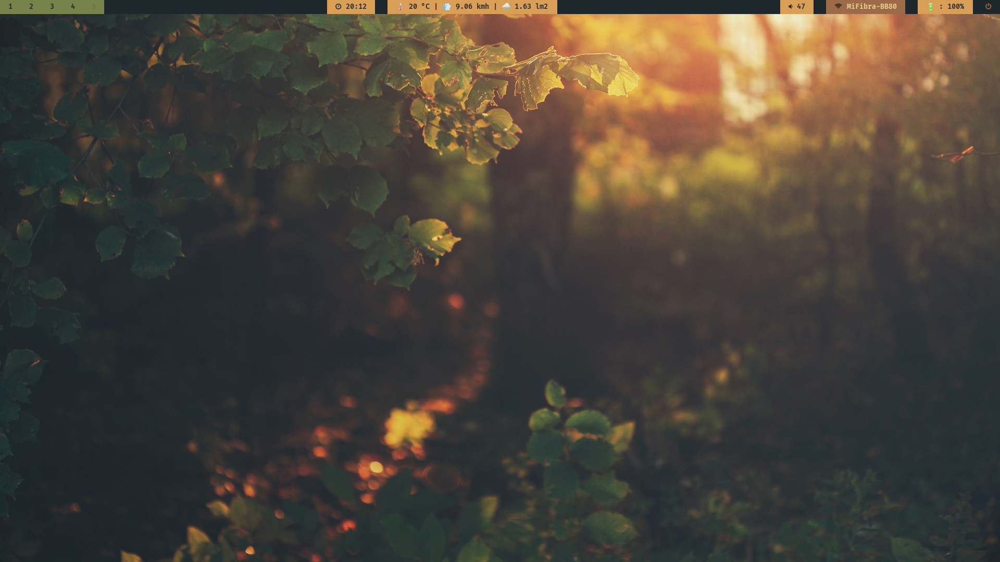

# CFOL Polybar Theme 🖥️

This repository contains a customized **Polybar** theme based on the `001` theme from the `stav121/i3wm-themer` project. It provides a clean and functional setup for i3, with several key additions to enhance the user experience.

---

### Features

* **PulseAudio Integration:** The theme has been modified to support the **PulseAudio** sound server, ensuring your volume controls work out of the box.
* **Battery Status Module:** A custom module was created to accurately display the battery status by reading data from the `/sys/class/power_supply/BAT0/capacity` file.
* **MeteoGalicia Weather Service:** The most significant addition is a custom-built weather service that provides up-to-date weather information specifically for the A Coruña region.

<p align="center">
    
</p>

---

### Weather Service Technical Details

The custom weather module is a Python application designed to efficiently retrieve and manage weather data from the [**MeteoGalicia API**](https://www.meteogalicia.gal/web/modelos-numericos/meteosix). To ensure it's both accurate and performant, the service was built with the following components:

* **Data Orchestration:** The core logic resides in `app.py`, which acts as the brain of the service. It checks two factors to determine if a weather update is needed: whether your location has changed or if the cached weather data has expired.
* **Intelligent Caching:** The `location_cache.py` class prevents redundant API calls by storing your current location and setting an expiration date on the cached weather data. This saves bandwidth and reduces load on the API.
* **Database Management:** The service uses **SQLite3** as a lightweight relational database to store the retrieved weather data. The database access object (DAO) is defined in `wdb_DAO.py`, which uses a configurable JSON file to manage the SQL queries, making the data layer flexible and easy to modify.
* **Service Layer:** The `services` directory contains classes for getting your geolocation using your IP and for sending requests to the MeteoGalicia API, cleanly separating the data-fetching logic.

---

## Installation/Set-up

### 1. Install System Dependencies

Install the required system packages using your distribution's package manager:

```bash
# Ubuntu/Debian
sudo apt update && sudo apt install i3 polybar python3 python3-venv python3-pip sqlite3 pulseaudio

# Arch Linux
sudo pacman -S i3-wm polybar python python-pip sqlite pulseaudio

# Fedora
sudo dnf install i3 polybar python3 python3-venv python3-pip sqlite pulseaudio
```

### 2. Clone the Repository

```bash
git clone https://github.com/your-username/polybar_theme.git
cd polybar_theme
```

### 3. Configure API Keys

⚠️ **Required**: Obtain your free API keys before installation:

* **MeteoGalicia API**: [Register here](https://www.meteogalicia.gal/web/modelos-numericos/meteosix)
* **IP Geolocation API**: [Get key here](https://ipgeolocation.io/)

Create a `.env` file in the project root:

```bash
echo 'API_MG="your_meteogalicia_api_key"' > .env
echo 'API_IP="your_ip_geolocation_api_key"' >> .env
```

### 4. Run the Installer

> [!NOTE]
> The install.sh script is currently being tested in a virtual machine and has not been uploaded yet.

```bash
./install.sh
```

The installer will automatically:
* Set up Python virtual environment and dependencies
* Backup your existing i3/polybar configurations
* Install the new theme configurations
* Make all scripts executable
* Initialize the weather database
* Set up systemd services for automatic weather updates

### 5. Apply the Theme

Restart i3 to apply the new theme:
* Press `Mod+Shift+R` (reload i3 configuration)
* Or logout and login again

Your polybar will automatically launch with the new theme and weather data will update every 5 minutes via systemd.

## Customization

### Wallpaper

The theme includes a default wallpaper (`001.png`) that will be automatically set. To use your own wallpaper, modify line 211 in your i3 config file (`~/.config/i3/config`):

```bash
exec_always --no-startup-id xwallpaper --daemon --zoom ~/.config/xwallpaper/your_wallpaper.png
```

Replace `your_wallpaper.png` with the path to your preferred wallpaper image.

---

### Credits

This project is a customization of the excellent work by `stav121`. The original theme can be found at:

* **Original Project:** `https://github.com/stav121/i3wm-themer`
